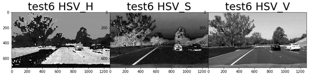
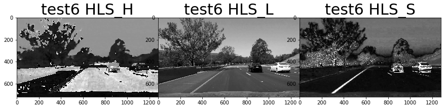

## Advanced Lane Finding 

In this project, the goal is to write a software pipeline to identify the lane boundaries in a video.  

The Project
---

The major steps for executing this project are the following:

* Compute the camera calibration matrix and distortion coefficients given a set of chessboard images.
* Apply a distortion correction to raw images.
* Use color transforms, gradients, etc., to create a thresholded binary image.
* Apply a perspective transform to rectify binary image ("birds-eye view").
* Detect lane pixels and fit to find the lane boundary.
* Determine the curvature of the lane and vehicle position with respect to center.
* Warp the detected lane boundaries back onto the original image.
* Output visual display of the lane boundaries and numerical estimation of lane curvature and vehicle position.

### 1. CAMERA CALIBRATION
---
Mapping 3D objects seen by camera lense into 2D images cause image distortion depending on the angle, distance etc. In order to leverage camera images taken in 3D space, for our application like self driving car, the distortion caused by camera lens needs to be corrected. This correction is usually done by taking multiple images of same object from varying angles, distance etc and calculate the differences, which then can be obtained as some parameter coefficients to undistort images captured by the lens in future. 
Chessboard images are the most commonly used images to calibrate camera, which basically involves identifying corners of a chessboard. We feed in a few various chess board images taken from same lens and calibrate the camera to identify the undistortion coefficients. 

*Figure 1 Corners detected on an example chessboard image*

*Figure 2 Undistortion performed on an example chessboard image*

### 2. PIPELINE(IMAGES)-  IMAGE TRANSFORMATION
---
_My Solution_:

   * Output: output_images/test_images_out
   * Notebook: advanced_lane_finding.ipynb 
   * Python Modules: image_process.py in util package.
   * Result notebook: advanced_lane_finding.html

Q1.	**Provide an example of a distortion-corrected image**

   A. Undistortion: Undistort() 
    
   We apply distortion correction on all test images using the function undistort(). Figure 3 shows undistortion performed on the test5 input image. 

*Figure 3 Undistortion performed on a test image*

Q2. **Describe how (and identify where in your code) you used color transforms, gradients or other methods to create a thresholded binary image. Provide an example of a binary image result.**
    
   A. Exploring Color Spaces: get_color_channels()
    
   My initial step was to explore different color spaces to threshold for. In the basic lane finding project, we simply created gray image and applied canny edge detection, which basically is not adequate to detect images in different light conditions, when there are shadows, varying lane colors etc. Therefore, we can study other color spaces to determine which of them are suited for thresholding for detecting lanes in varying conditions. 
    
   I studied three color channels: RGB, HSV and HLS as shown in the notebook. Figure 4, 5 and 6 shows an example color space exploration performed on the input image test6. 
   

*Figure 4 RGB color space visualization on image test6*

*Figure 5 HSV color space visualization on image test6*

*Figure 6 HLS color space visualization on image test6*

   From the observation, I concluded that there is no single color space that meets or work for all conditions and I decided to go for a combination of multiple color spaces making the following observations. 

   * RGB: R & G channels seem to detect yellow lanes well
   * HLS: L channel seem to ignore edges added due to shadows
   * HLS: S channel seems to work well for yellow lane detections

After performing a few experiments, I did not use HSV as S channel from HLS was already working for the same case.

   B. Gradient and Binary Thresholding: get_binary_thresholded_image()
   Firstly, I used Sobel absolute and direction thresholding on the image converted to gray scale.
   From RGB color space, Get R and G channels and threshold at 150. Detection condition is detection of both these channels.
   From HLS color space, L and S channel are both thresholded between 100 and 255.
   Final detection is combination of R, G and L and the S condition or gradient detection from sobel thresholds.
   Finally,  apply a Region of Interest mask on the image considering area of interest as a triangular area area from bottom of the        image to center of the image, to avoid unwanted detections in the thresholded image. 
   An example of a binary thresholded image is shown in Figure 7 below.

*Figure 7 Binary thresholding performed on image test5*

3. **Describe how (and identify where in your code) you performed a perspective transform and provide an example of a transformed image.**

  A. Perspective Transform: apply_warp()
  Perspective transform is used to convert set of coordinates in an image to a different set of coordinates to get the image view from a different desired angle. We use this technique to get bird’s eye view of the lanes in the lane images which will help detection of curved lanes better as we can produce parallel lines of all lanes in a bird’s eye point of view.
For this we need two sets of coordinates. Source image coordinates as well as destination coordinates to transform the source image into. Considering the position of camera and lane location, I chose the points doing a bit of manual trial and error both for source coordinates as well as destination points.  An example of an image to which perspective transform is applied to is shown in Figure 8 below.

*Figure 8  Example of a perspective transformed image*

### PIPELINE(IMAGES)-  LANE PIXEL DETECTION USING POLYFIT
---
My solution:
*	Output: output_images/test_images_out
* Notebook: advanced_lane_finding.ipynb
* Module: lane_detection.py in util package
* Result: advanced_lane_finding.html
4. Describe how (and identify where in your code) you identified lane-line pixels and fit their positions with a polynomial?
To identify the lane pixels within the thresholded warped image, we use a sliding window search technique to capture the most likely regions of the pixel positions and then try to run a polyfit algorithm to identify the fitting polynomial that fits all pixels captured within the sliding window search. 
The most logical way to identify the region of lane lines in a warped image would be to take histogram of pixels along horizontal axis.
A. Histogram of pixels Horizontal Axis: plot_histogram()
Considering that warped image produces parallel lines in white pixels, we would get two high peaks of pixel count along horizontal axis. We identify the two peak points of pixels in first half and second half of image as the points left and right lane. Then we apply sliding window search on the image using these points as starting point.  An example histogram is shown in Figure 9 below for test image test4. 

B. Sliding Window Search: polyfit_sliding_window()
Windows are drawn within a margin specified as 100, around the x-co-ordinates obtained from histogram peak for both left and right lanes, and all the pixels within the window are recorded. Number of windows can be specified and window center point is updated for every window from the identification of pixels in previous window. This helps in capturing curved lines properly, even if warped image is not completely parallel. Once all pixels within the windows are stored, we create a second order polynomial that fits the detected points and draw the lanes. An example image on which sliding window search is performed  is shown in Figure 10 below for test image test4. 

Sliding window search looks for lane pixels by searching throughout the image. In a video, this computation can be reduced if we store the previous lane locations and start from the previously detected points. This is done using a polyfit using previous fit information function. 
C. Polyfit Using Previous Fit: polyfit_using_previous_fit()
In this function,  we pass the polynomial fitting from previous fit and search around that area for the new pixel positions and generate a new fitting polynomial. The green shaded region in the image shows the previously fitted region, and the lines show the newly fitted polynomial with the identified pixels in red and blue respectively for left and right lanes. To study this, the algorithm has been applied on same image for now. An example image on which polyfit using previous search information window search is used  is shown in Figure 11 below for test image test4. 

5. Describe how (and identify where in your code) you calculated the radius of curvature of the lane and the position of the vehicle with respect to center.

A. Radius of Curvature: measure_radius_of_curvature()
Radius of curvature is calculated using the equation provided in the course material. Radius is calculated using the fitting polynomial coefficients and the position on image based on which curvature can be calculated. This point is chosen as bottom of the image. Additionally, pixel to real world conversion has been done to get the curvature value in meters. Correction factor for this is used based on the size of the images input. 
Conversions in x and y from pixels space to meters is performed based on these parameters. 

    ym_per_pix = 30/720  # meters per pixel in y dimension
    xm_per_pix = 3.7/700  # meters per pixel in x dimension
Equation for computation of radius is present in the code.

B. Center Offset of Vehicle: measure_center_offset()
Position of the vehicle with respect to center is calculated by first identifying the midpoint of both the lanes on x-axis, taking the x fits at maximum value and then subtracting the same from the car position, which is taken as the horizontal midpoint. Later the pixel values are mapped to meters as explained previously for curvature.
6. Provide an example image of your result plotted back down onto the road such that the lane area is identified clearly.
Below is the test2 image, that has lanes identified correctly and distance measurements added on top. 

### PIPELINE(VIDEO)
---
1. Provide a link to your final video output. Your pipeline should perform reasonably well on the entire project video (wobbly lines are ok but no catastrophic failures that would cause the car to drive off the road!).
My solution:
•	Output: project_video_output.mp4
•	Notebook: advanced_lane_finding_video.ipynb
•	Python Modules: camera.py, image_process.py and lane_detection.py in util package.

A. Pipeline
Once I executed all steps needed for the lane detection and reached a satisfactory solution, I created a new notebook with a lane_processing_pipeline() function for videos which uses an image_processing_pipeline() function  for the initial preprocessing of every frame. 
A class Line() in introduced to store the past best fit polynomial for both lanes as well as the pixel indices. Line takes an input count, which is the number of previous frames of which polynomial fits should be remembered. Current best fit is taken as average of the last n number of the polynomial fits stored.

### DISCUSSION
---
1. Briefly discuss any problems / issues you faced in your implementation of this project. Where will your pipeline likely fail? What could you do to make it more robust?
I think my video processing pipeline can be quite improved by using other information like the previous pixel positions to make the detection more robust. Due to time limitations, I have worked out only for the project video which has similar lanes corresponding to test images.
Exploring different color spaces might improve the pipeline in various other lighting and weather conditions.
Applying perspective transform involved a bit of manual trial and error in choosing the coordinates which should be improved probably for videos with varying curvatures. Estimating distance between lanes would be a good way of getting the lanes right.

